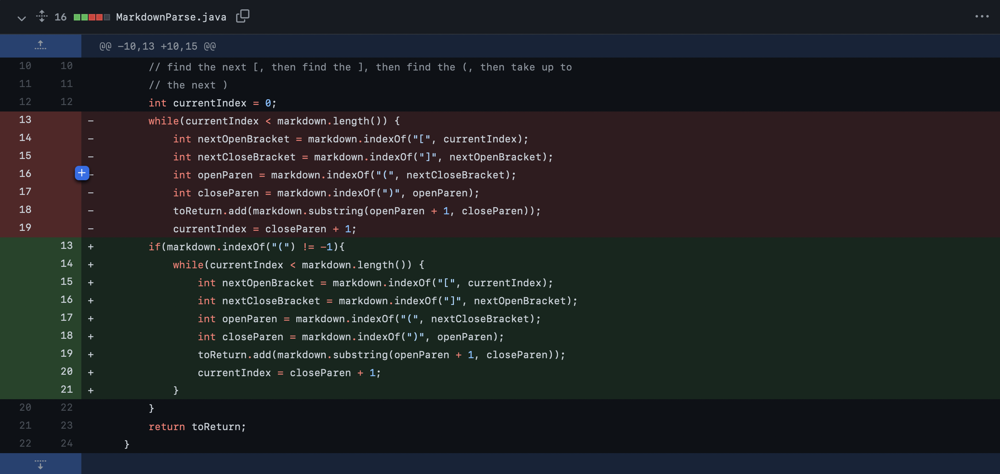
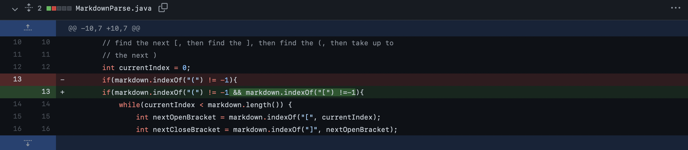
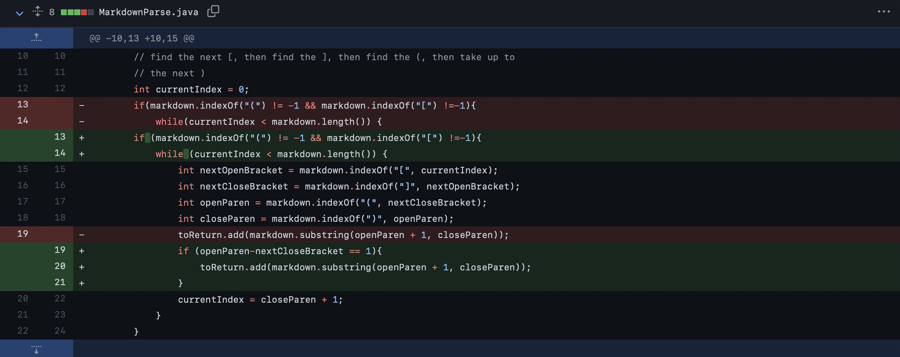

<p align="center">
    <h1 align="center">CSE 15L: Lab Report 2</h1>
</p>

<p align="center">
  
</p>

# Introduction

* This lab report will be discussing the relationship between the bug, the symptom, and the failure inducing input in the codes written during lab 3 and 4. 

---

# Code Change 1



### Failure-inducing input: [test1](https://github.com/Quanzat/markdown-parse/blob/main/test1.md)

### Output:

```
Exception in thread "main" java.lang.StringIndexOutOfBoundsException: begin 0, end -1, length 19
        at java.base/java.lang.String.checkBoundsBeginEnd(String.java:3751)
        at java.base/java.lang.String.substring(String.java:1907)
        at MarkdownParse.getLinks(MarkdownParse.java:18)
        at MarkdownParse.main(MarkdownParse.java:26)
```

<p align="right">
    <h4 align="right">(Figure. 1)</h4>
</p>

* Discussion:
    * In this case, the bug in this failure-inducing code is that `[a link!] google.com` is in a wrong format because it doesn't have parenthesis around `google.com`. As a result the symptom of this code throw an `IndexOutOfBoundsException` (Figure. 1). This is because after the code is run, index for `closeParen` is at `-1`, which is out of bound. 

* Solutions:
    * The solution that our group came up together is to include an `if` statement (Figure. 2) to account for a bug input where no parenthesis is found.

```
if (markdown.indexOf('(' != -1)) 
```

(Figure. 2)

---
# Code Change 2



### Failure-inducing input: [test2](https://github.com/Quanzat/markdown-parse/blob/main/test2.md)

* Output:

```
[(youtube.com]
```

* Discussion:
    * temp


---
# Code Change 3



### Failure-inducing input: [test3](https://github.com/Quanzat/markdown-parse/blob/main/test3.md)

* Output:

```
[(google.com]
```

* Discussion:
    * temp


