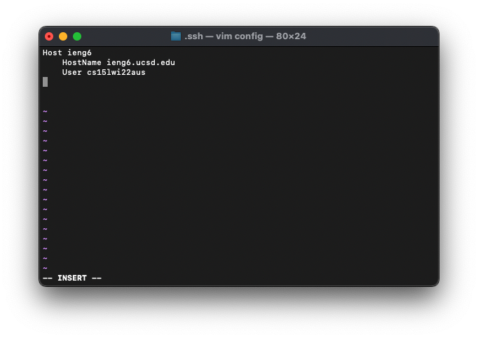
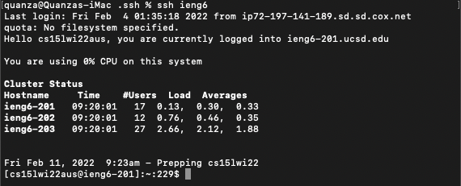

<p align="center">
    <h1 align="center">CSE 15L: Lab Report 3</h1>
</p>

<p align="center">
  
</p>

# Introduction

* This lab report will be about streamline the ssh configuration to log into 
ieng6 computer a bit faster and even a bit more personalized if you choose.

---

# Goal

* Before, logging into ieng6 require command lines such as 
`ssh cs15lwi22zzz@ieng6.ucsd.edu` then you would have to enter your password. 
If, you already streamline the process of logging into ieng6 computer, you 
wouldn't have to even enter a password.

* Our goal now is to log in to ieng6 computer with only input such as `ssh ieng6` 
and you would be able to log in.

---

# Editting The `.ssh` Directory

* On your computer, open terminal and enter the following command:

    `cd .ssh`

* For the next step, if you already have a config file in your `.ssh` directory, you can just use the command below to access it: 

    `~/.ssh/config`

* However, if you do not have the config file already, enter the following command to create a config file in the ssh directory and your terminal should look the picture below:

    `vim config`


* Next, copy and paste this code below into the config file: 

    ```
    Host ieng6
        HostName ieng6.ucsd.edu
        User cs15lwi22zzz (use your username)
    ```

    NOTE: Replace the `zzz` with your specific username (Example below). 



* Once you are finished, save and exit the file. If you are using the `vim` command, press escape (`esc`) on your keyboard. Then enter the code below to save and exit from the file:

    `:wq`


---

# Logging Into ieng6
* Now that you have finished editing the config file for your ssh configuration. You can now log into the ieng6 computer with the command below:

    `ssh ieng6`

    

---

# SCP With New Username
* Below is a demonstration of doing a secure copy a file into ieng6 using the new username using the command below:

    `scp lol.JPG ieng6`


    

---
# Extra
* For this section, we will cover a troubleshooting step that you might need if you encounter an issue logging into the ieng6 server. Moreover, we will also cover a fun step to personalized your username for when calling `ssh`.

## Troubleshooting
* To troubleshoot an issue where you can not log into the ieng6 server with `ssh ieng6`, completing this step below might solve the problem.

    * Reopen the config file and add in this line under your username:
    
        `IdentityFile ~/.ssh/id_rsa_ucsd`


## Personalizing Your ssh Username
* To personalized your ssh username, you would just change the name after `Host` in the config file. (For example, the picture below demonstrate username to be `qutran`).


* The image below showcase how you can now log in with your personal username.

    
    
---
<p align="center">
    <h1 align="center">The End</h1>
</p>
<p align="center">
    <h1 align="center">Thank you for reading.</h1>
</p>

---