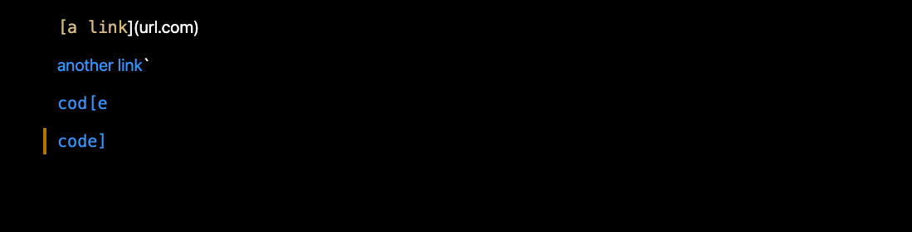
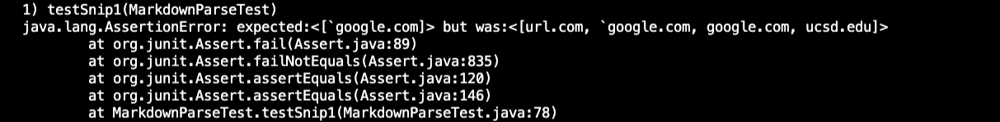
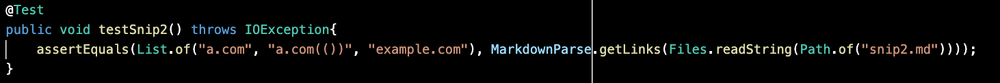

<p align="center">
    <h1 align="center">CSE 15L: Lab Report 4</h1>
</p>

<p align="center">
  
</p>

# Introduction

* This lab report will be discussing errors and fixes with provided code snippets to test the implementations of MarkdownParse. 

---

# Code Repositories

* Below is two code implementation that we will be reviewing for this lab report. 

## My Implementation

* [MarkdownParse](https://github.com/Quanzat/markdown-parse)

## Reviewed Implementation

* [Reviewed MarkdownParse](https://github.com/Darrengn/markdown-parse)

---

# Snippet 1

## Snippet Output



## Expected Output

```[`google.com, google.com, ucsd.edu]```

## My Implementation

### Test code


### Test Output


### Discussion

filler filler filler filler filler filler filler filler filler filler filler filler filler filler filler filler filler filler filler filler filler filler filler filler filler filler filler filler filler filler filler filler filler filler filler filler filler filler filler filler filler filler filler filler filler filler filler filler filler filler filler filler filler filler filler filler filler filler filler filler filler filler filler filler filler filler filler filler filler filler filler filler filler filler filler filler filler filler filler filler filler filler filler filler filler 


## Reviewed Implementation

### Test code


### Test Output



---

# Snippet 2

## Snippet Output


## Expected Output

```[a.com, a.com(()), example.com]```

## My Implementation

### Test code


### Test Output


### Discussion

filler filler filler filler filler filler filler filler filler filler filler filler filler filler filler filler filler filler filler filler filler filler filler filler filler filler filler filler filler filler filler filler filler filler filler filler filler filler filler filler filler filler filler filler filler filler filler filler filler filler filler filler filler filler filler filler filler filler filler filler filler filler filler filler filler filler filler filler filler filler filler filler filler filler filler filler filler filler filler filler filler filler filler filler filler 


## Reviewed Implementation

### Test code



### Test Output


---

# Snippet 3

## Snippet Output


## Expected Output

```[https://ucsd-cse15l-w22.github.io/]```

## My Implementation

### Test code


### Test Output


### Discussion

filler filler filler filler filler filler filler filler filler filler filler filler filler filler filler filler filler filler filler filler filler filler filler filler filler filler filler filler filler filler filler filler filler filler filler filler filler filler filler filler filler filler filler filler filler filler filler filler filler filler filler filler filler filler filler filler filler filler filler filler filler filler filler filler filler filler filler filler filler filler filler filler filler filler filler filler filler filler filler filler filler filler filler filler filler 

## Reviewed Implementation

### Test code


### Test Output


---
<p align="center">
    <h1 align="center">The End</h1>
</p>
<p align="center">
    <h1 align="center">Thank you for reading.</h1>
</p>

---