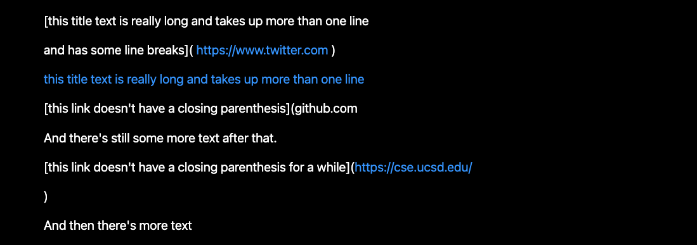

<p align="center">
    <h1 align="center">CSE 15L: Lab Report 4</h1>
</p>

<p align="center">
  
</p>

# Introduction

* This lab report will be discussing errors and fixes with provided code snippets to test the implementations of MarkdownParse. 

---

# Code Repositories

* Below is two code implementation that we will be reviewing for this lab report. 

## My Implementation

* [MarkdownParse](https://github.com/Quanzat/markdown-parse)

## Reviewed Implementation

* [Reviewed MarkdownParse](https://github.com/Darrengn/markdown-parse)

---

# Snippet 1

## Snippet Output


## Expected Output

```[`google.com, google.com, ucsd.edu]```

## My Implementation

### Test code


### Test Output


### Discussion

* For this bug, it is doable to fix this code with changes that is less than 10 lines of code. We achieve this by adding in a couple lines that would check the indexes of backticks, brackets and parenthesis. This would check if any markdown contain brackets or parenthesis within any indexes of backsticks, and if so, then the code would break, and return `[]` as the correct result. 

## Reviewed Implementation

### Test code


### Test Output


---

# Snippet 2

## Snippet Output


## Expected Output

```[a.com, a.com(()), example.com]```

## My Implementation

### Test code


### Test Output


### Discussion

* This code is not fixable with any code that is less than 10 lines. Firstly, we need to consider that some code within this snippet work while others do not. Moreover, the third code did not even produce an output at all. To fix this we would need to add in some lines that would check for each specific condition. Therefore, these errors and its complexity would require more than 10 lines to fix as each case would need to be considered. 

## Reviewed Implementation

### Test code


### Test Output


---

# Snippet 3

## Snippet Output


## Expected Output

```[https://ucsd-cse15l-w22.github.io/]```

## My Implementation

### Test code


### Test Output


### Discussion

* Considering this bug, it is possible to fix the code within 10 lines as we would need to add in some code that check if the close parenthesis is also on the same line as the open parenthesis. If two parentheses is not on the same line then the code would break and return `[]` as the correct output. 

## Reviewed Implementation

### Test code


### Test Output


---
<p align="center">
    <h1 align="center">The End</h1>
</p>
<p align="center">
    <h1 align="center">Thank you for reading.</h1>
</p>

---