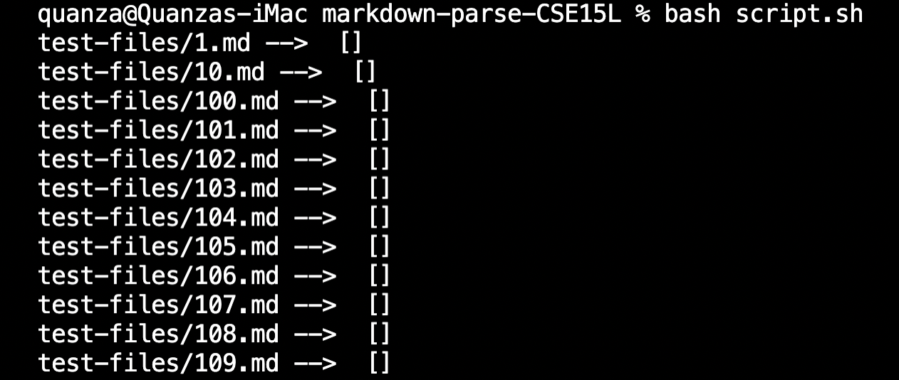
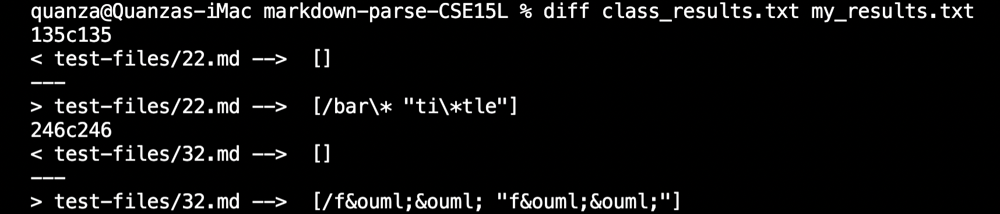
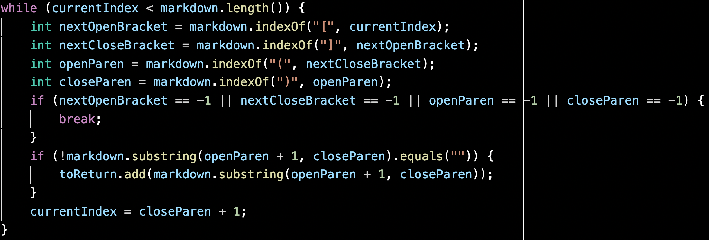

    <h1 align="center">CSE 15L: Lab Report 5</h1>

  

# Introduction

* This lab report will be discussing the differences the output result using two different MarkdownParse implementations, specifically, my own implementation and the implementation provided from the class. After analyzing the differences, we will be taking a look at each implementation and discussing the bug and how to fix it. 

---

# Getting The Test Results

* The first thing is getting the results produced by the class implementation and my own implementation to compare. 

    * Before running `bash script.sh` to get all the outputs, I made some modifications to the `script.sh` file to not only print the result, but also print the test file as well. I accomplish this by adding in the following code to the `script.sh` file:

        `echo -n $file`
    
    * For readability, I also added in the following code:

        `echo -n " -->  "`

    * The output are shown as follows:

        

---

# Comparing The Test Results

* In order to compare the results produced by my own implementation and the implementation from the class, I added the test result into a text file with the following command:

    `bash script.sh > class_results.txt` 

    `bash script.sh > my_results.txt`

    NOTE: 
    * `class_results.txt` is the output from the implementation provided from class. 

    * `my_results.txt` is the output from the implementation from me.

* Then, to compare the two files, I used the command `diff` to compare the two file by running the following command:

    `diff class_results.txt my_results.txt`

    

    NOTE: 
    
    * The first result is the result obtained from the class implementation, and the second one is my own implementation. 

    * There are also substantially more differences, but this is the first 2 from the list, which is why there are only two differences in the above screenshot. 

---
# Differences #1

* The first differences between the two files is within test file called `22.md`. 

## The Output Of The File:

* The expected output:

    

* My Implementation Output:

     
    
* Class Implementation Output:

     

## Discussion:

* From the output from both my own and the class implementation, we can see that the output are both wrong. The expected output in this case is supposed to return `foo` which is a link to a non-existing destination.

* Identifying The Bug In MarkdownParse (My Implementation):

     

* The issue within my code is that it within the while loop, does not check for what could be a potential link within the parenthesis. By potential link, I am referring to checking if there are quotations within the parenthesis. So to fix this, we would have to add in an if condition to check for a potential link within the parenthesis. The location where this code could be is after the last if statement but before the line `currentIndex = closeParen + 1;`. 

---
# Differences #2
* The second differences between the two files is within test file called `32.md`. 

## The Output Of The File:

* The expected output:

    

* My Implementation Output:

     
    
* Class Implementation Output:

     

## Discussion:

* The output for the second differences is identical to the first one as both my implementation and the class is wrong. The expected output is supposed to be `foo` and not the one we got. 

### Identifying The Bug In MarkdownParse (My Implementation)

 

* Similar to the previous differences, my code is not checking for a potential link within the parenthesis. Therefore, adding an if condition to check for a potential link within the while loop should fix the problem. 
---

    <h1 align="center">The End</h1>

    <h1 align="center">Thank you for reading.</h1>

---
