<p align="center">
    <h1 align="center">CSE 15L: Course-specific Account and Ieng6 Computer</h1>
</p>

---
## How to gain access to a course-specific account?
* First, in order to gain access to a course-specific account, you must go to https://sdacs.ucsd.edu/~icc/index.php and look up your assigned account address. 


* Second, you will then need to enter your UCSD username and Student ID, which will prompt information about what course-specific account belongs to your student ID.


* You will be asked to change your password in order to activate your course-specific account. This process will take up to several minutes for the changes to take effect. (Note: You can your current PID password if it met all the requirements.)

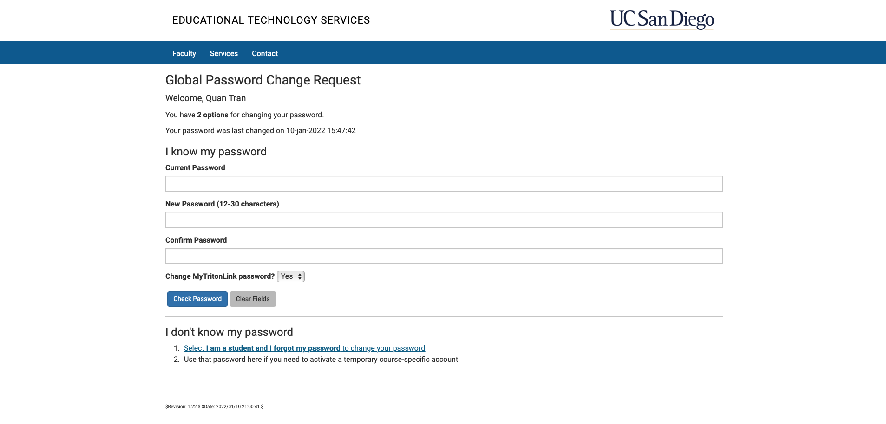

## How to access Ieng6 Computer?
* There are two ways to access the Ieng6 computers. The first is to access them on campus in the CSE building. The second way is to access them remotely. For this course specifically, you will be using <strong> Visual Studio Code </strong> to remotely access these computers and do work on them. 
* To connect remotely, you will need your course-specific account and password that you have set in order to activate that account to log into the computer. 

## What is Visual Studio Code and how to get it?
* This is an IDE which is also known as a code editor. It works like any other code editor out there. 
* You can obtain it by either searching it up or going to this link here: https://code.visualstudio.com/
* There is a version for every platform out there so no need to worry about device compatibilities.

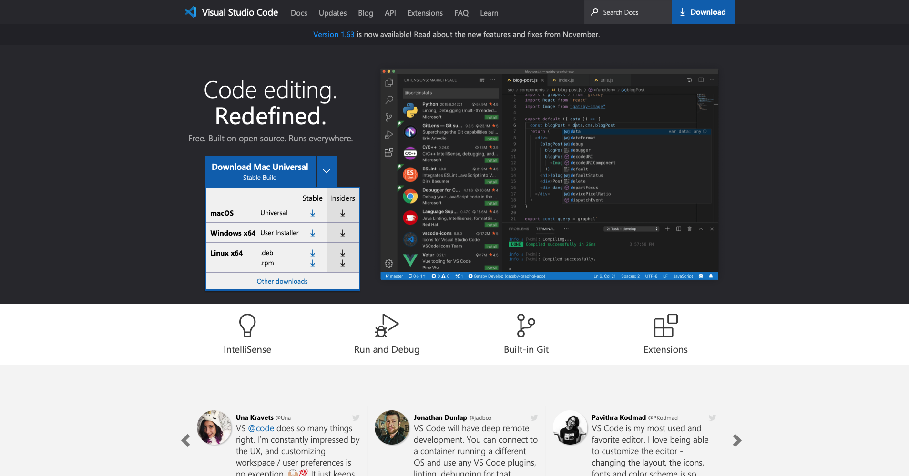

## Accessing Ieng6 Computer Remotely
* Once you have obtained Visual Studio Code, you should see this screen. (Note: It might look different depending on the operating system you are on.)

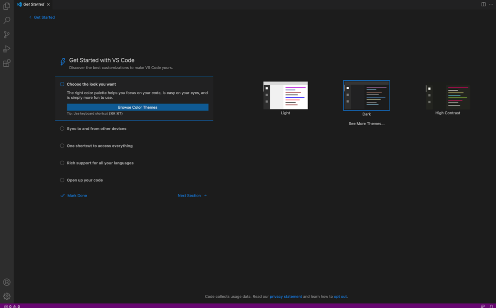

* From here you will then open the terminal. To achieve this, you either use keyboard shortcut (Ctrl or Command + `) or navigate to Terminal --> New Terminal. 


* In the terminal, you will run a secure shell to the ieng6 computer with your course-specific address. Use the following command to begin (Note: The "zz" is replaced with your specific assigned letters): 
    
    `ssh cs15lwi22zz@ieng6.ucsd.edu`

* For the first time connecting, you will get this message similar to the image below. All you need to do is type "yes". 

    ```
    The authenticity of host 'ieng6.ucsd.edu (128.54.70.227)' can't be established.
    RSA key fingerprint is SHA256:ksruYwhnYH+sySHnHAtLUHngrPEyZTDl/1x99wUQcec.
    Are you sure you want to continue connecting (yes/no/[fingerprint])? 
    ```

* You will then be prompted to enter your password (Note: While typing your password, nothing will appear on the screen and that is to be expected. Just continute and press enter once you are done typing it).

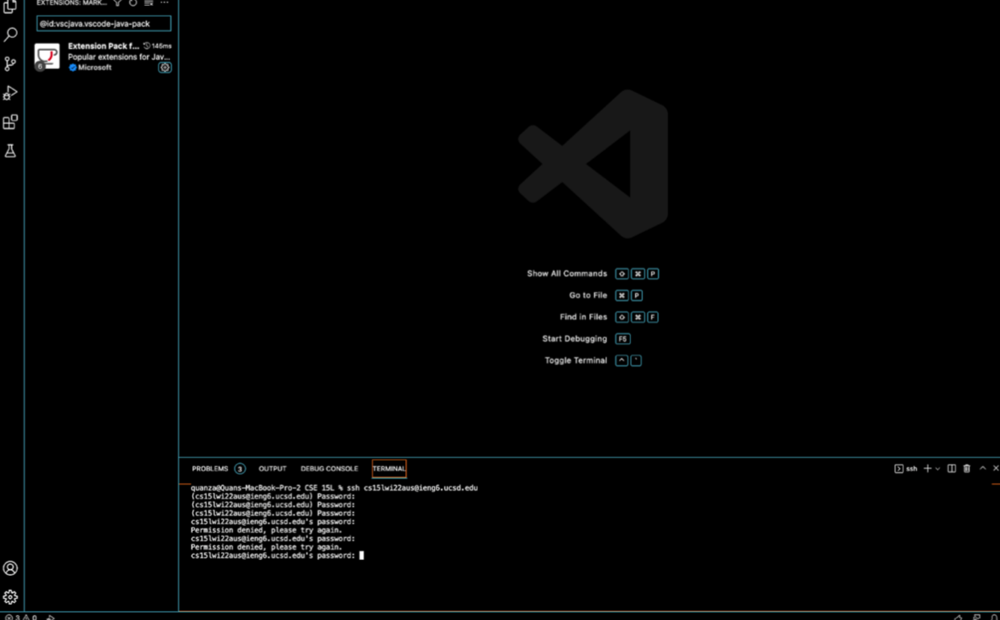

* Once you are logged in, your screen will look something like this

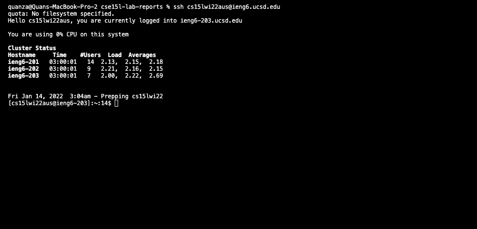


## Use commands on the Ieng6 Computer
* Now that you are on the server, you can now try out some commands:
    * `cd` = Change directory
    * `cd~` = Go to home directory
    * `ls` = List all files in the current directory
    * `pwd` = Print the current directory
    * `scp` = secure copy 

### Example

* Using `pwd` to see the curreny directory

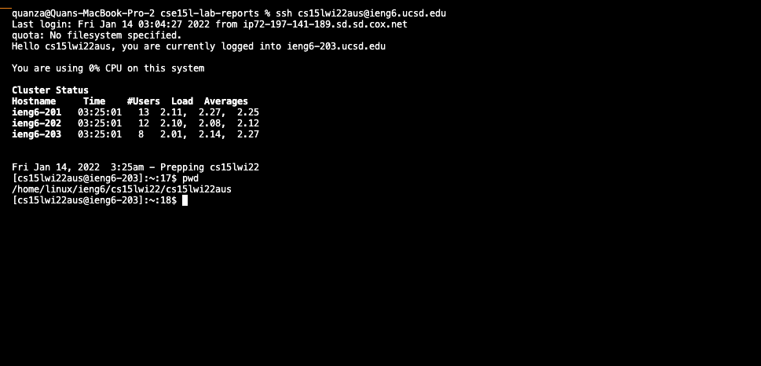

* Using `ls` to list files in the directory

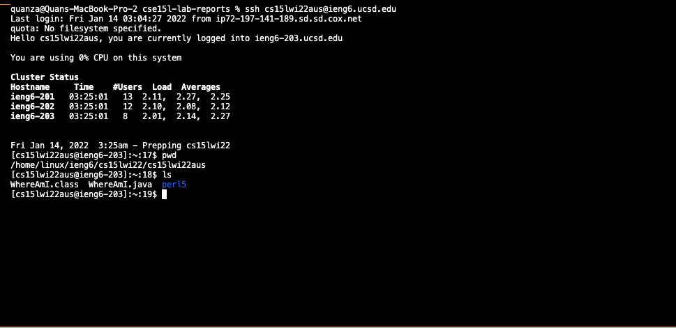

## Doing a secured copy to Ieng6 Machine
* Assuming you have some java files you would like to run on the Ieng6 machine, in order to do so, you would need to copy that file into the machine and then run it using `javac <file name>.java` and `java <file name>`.

* First, you need to locate where the java file is located on your computer. 
    * For example, mine is located in lab1 folder. I would need to run `cd '/Users/quanza/Desktop/CSE 15L/Lab1'` to change the directory to that folder. 

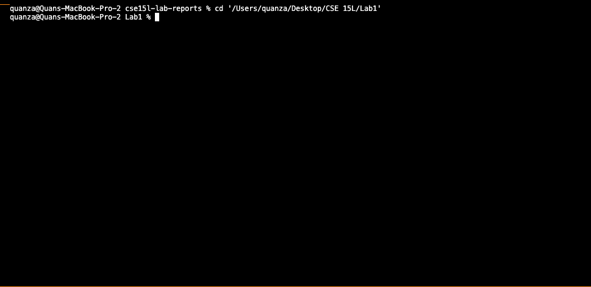

* Second, you would use `scp` to do the copy. To do this, type this command `scp <file name>.java <your course-specific address>:~/`

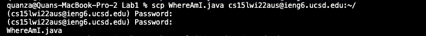

* You will be prompted to enter your password. After inputting your password, your file should be securely copied to the Ieng6 Machine.
* To check if your file has been successfully sent, you could log into the Ieng6 Machine and use the `ls` command to check if your file is there.


## Using SSH key to access Ieng6
### Generating a key
* The step of inputting a password each time you want to send something to the server could be annoying. A solution to that is to set up an SSH key to gain access to the server without the need for a password. 

* To do this, start by opening up a terminal on your computer (not the Ieng6 Machine) then type in `ssh-keygen`

* When prompt to "enter file in which to save the key (Users/`<your name>`/.ssh/id_rsa):" just copy the part in the parentheses then click enter. 

* When prompt to do password, just leave it blank by clicking enter twice. 

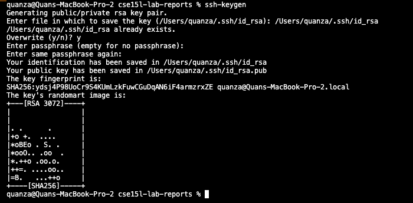

### Creating a directory called .ssh on the server
* Log in to the server and use the command `mkdir .ssh`. Once you are done, just log out of the Ieng6 Machine.

### Copy the generated key into the newly created directory on the server
* In the terminal run an scp command with your newly created public key
* The command line should look something like this:

    `scp /Users/<your name>/.ssh/id_rsa.pub cs15lwi22aus@ieng6.ucsd.edu:~/.ssh/authorized_keys`

* Congrats! Now you can log into the Ieng6 Machine without a password. 

## Optimizing Remote Running
* Now that you eliminated the password, let try some command lines that makes the remote running even faster.
* Instead of logging into the machine and then running commands like `ls` you can now use a command line such as `ssh cs15lwi22zz@ieng6.ucsd.edu ls` to just remotely run it on your local machine instead of logging in. 

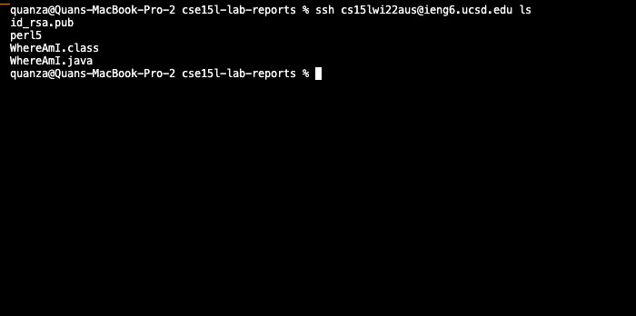

<p align="center">
    <h1 align="center">Thank you for reading! The End.</h1>
</p>
